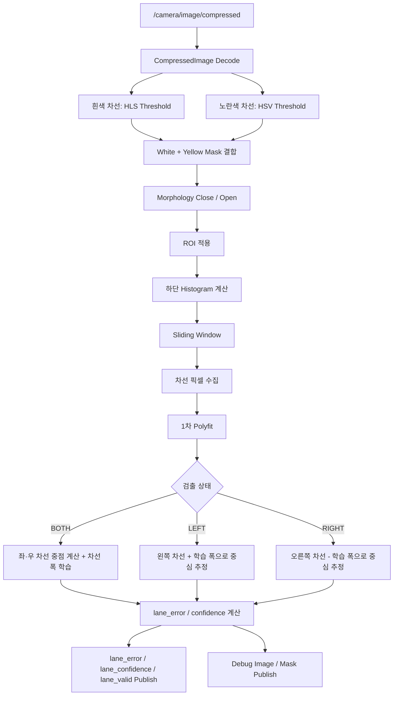
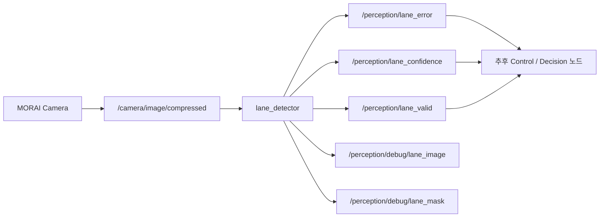

# OpenCV 차선 인지 패키지 (`lane_opencv_pkg`)

## 1. 패키지 개요

`lane_opencv_pkg`는 ROS 2 환경에서 카메라 압축 영상을 입력받아 **흰색/노란색 차선을 검출하고, 차로 중심 오차와 신뢰도, 검출 유효 여부를 발행하는 인지(Perception) 패키지**이다.

현재 패키지는 **차선 인지까지만 담당**하며, 조향각·가속·제동 명령은 직접 생성하지 않는다.

주요 기능은 다음과 같다.

- `/camera/image/compressed` 압축 카메라 영상 구독
- HLS/HSV 기반 흰색·노란색 차선 후보 추출
- ROI(관심영역) 제한
- Morphology 기반 노이즈 정리
- Histogram + Sliding Window 기반 차선 픽셀 추적
- 1차 다항식 직선 피팅
- 양쪽 차선 검출 시 차선 폭 학습
- 한쪽 차선만 검출될 때 학습된 차선 폭으로 차로 중심 추정
- 차로 중심 오차(`lane_error`) 계산
- 검출 신뢰도(`lane_confidence`) 계산
- 검출 결과 존재 여부(`lane_valid`) 발행
- 디버그 영상 및 바이너리 마스크 발행

---

## 2. 패키지 구조

```text
lane_opencv_pkg/
├── package.xml
├── setup.py
├── setup.cfg
├── resource/
│   └── lane_opencv_pkg
├── test/
└── lane_opencv_pkg/
    ├── __init__.py
    └── lane_detector.py
```

실제 차선 인지 알고리즘은 다음 파일에 구현되어 있다.

```text
lane_opencv_pkg/lane_detector.py
```

---

## 3. 노드 구성

| 항목 | 내용 |
|---|---|
| Package | `lane_opencv_pkg` |
| Executable | `lane_detector` |
| Node name | `perception_node` |
| 구현 언어 | Python |
| 주요 라이브러리 | ROS 2 `rclpy`, OpenCV, NumPy |

실행:

```bash
ros2 run lane_opencv_pkg lane_detector
```

---

## 4. 사용 토픽

### 입력

| 기능 | 토픽 | 메시지 타입 | 설명 |
|---|---|---|---|
| 카메라 입력 | `/camera/image/compressed` | `sensor_msgs/msg/CompressedImage` | MORAI 카메라 압축 영상 |

카메라 입력에는 `qos_profile_sensor_data`를 사용한다.

### 출력

| 기능 | 토픽 | 메시지 타입 | 설명 |
|---|---|---|---|
| 차로 중심 오차 | `/perception/lane_error` | `std_msgs/msg/Float32` | 영상 중심 대비 추정 차로 중심의 정규화 오차 |
| 차선 신뢰도 | `/perception/lane_confidence` | `std_msgs/msg/Float32` | 검출 픽셀 수 기반 내부 신뢰도 |
| 차선 유효 여부 | `/perception/lane_valid` | `std_msgs/msg/Bool` | 현재 프레임에서 `detect_lane()` 결과가 존재하는지 여부 |
| 디버그 영상 | `/perception/debug/lane_image` | `sensor_msgs/msg/Image` | ROI, 차선 피팅, 중심점, 오차 등을 시각화 |
| 차선 마스크 | `/perception/debug/lane_mask` | `sensor_msgs/msg/Image` | 차선 후보만 남긴 `mono8` 바이너리 영상 |

> **주의:** 현재 `lane_valid=True`는 “신뢰도가 충분히 높다”는 뜻이 아니라, `detect_lane()`이 최종 결과를 반환했다는 뜻이다. 현재 코드에서는 `confidence` 값 자체를 `lane_valid` 판정 조건으로 사용하지 않는다.

---

## 5. 전체 알고리즘 흐름



---

## 6. 차선 후보 마스크 생성

### 6.1 흰색 차선

흰색 차선은 HLS 색공간에서 검출한다.

```python
white_lower = [0, 170, 0]
white_upper = [255, 255, 140]
```

### 6.2 노란색 차선

노란색 차선은 HSV 색공간에서 검출한다.

```python
yellow_lower = [12, 70, 70]
yellow_upper = [42, 255, 255]
```

두 마스크는 OR 연산으로 결합한다.

### 6.3 Morphology

결합된 마스크에 `5 x 5` 커널을 사용하여 다음 순서로 노이즈를 정리한다.

1. `MORPH_CLOSE`
2. `MORPH_OPEN`

---

## 7. ROI(관심영역)

전체 영상에서 차선을 찾지 않고 도로가 존재할 가능성이 높은 영역만 사용한다.

현재 ROI 꼭짓점은 영상 크기에 대한 비율로 정의되어 있다.

| 꼭짓점 | x | y |
|---|---:|---:|
| 좌하단 | `0.02 × width` | `0.98 × height` |
| 좌상단 | `0.15 × width` | `0.35 × height` |
| 우상단 | `0.90 × width` | `0.35 × height` |
| 우하단 | `0.98 × width` | `0.98 × height` |

---

## 8. Histogram + Sliding Window

ROI 적용 후 영상의 아래쪽 절반을 사용해 x축 Histogram을 계산한다.

영상 중앙을 기준으로:

- 왼쪽 절반의 최대값 → 왼쪽 차선 시작점
- 오른쪽 절반의 최대값 → 오른쪽 차선 시작점

현재 주요 값:

| 항목 | 값 |
|---|---:|
| Histogram 최소 peak | `5.0` |
| Sliding Window 개수 | `9` |
| Window margin | `max(40, width × 0.08)` |
| Window 재중심 최소 픽셀 | `30` |
| 차선 피팅 최소 픽셀 | `150` |

---

## 9. 차선 피팅

현재 차선은 1차 다항식으로 피팅한다.

```text
x = a × y + b
```

즉, 현재 구현은 **직선 피팅 기반**이다.

차로 중심 계산에 사용하는 기준 y 위치는 다음과 같다.

```text
lookahead_y = 0.80 × image_height
```

---

## 10. 차선 폭 학습

### 10.1 기본 차선 폭

학습된 차선 폭이 없을 때는 영상 폭을 기준으로 기본값을 사용한다.

```text
default_lane_width = 0.4375 × image_width
```

### 10.2 양쪽 차선이 모두 검출된 경우

```text
measured_lane_width = right_x - left_x
```

허용 범위:

```text
0.20 × image_width
≤ measured_lane_width
≤ 0.90 × image_width
```

범위를 벗어나면 해당 프레임의 차선 검출 결과를 사용하지 않는다.

### 10.3 EMA 기반 차선 폭 학습

정상 범위의 차선 폭은 Exponential Moving Average 방식으로 학습한다.

```text
new_width
= 0.8 × old_width
+ 0.2 × measured_width
```

현재 학습 계수는 `alpha = 0.20`이다.

새 측정 폭이 기존 학습 폭과 `35%` 이상 차이 나면 차선 검출 자체를 실패 처리하지 않고 **폭 학습만 건너뛴다.**

---

## 11. 검출 모드

### BOTH

왼쪽과 오른쪽 차선을 모두 검출한 경우:

```text
lane_center = (left_x + right_x) / 2
```

### LEFT

왼쪽 차선만 검출한 경우:

```text
lane_center = left_x + lane_width / 2
```

### RIGHT

오른쪽 차선만 검출한 경우:

```text
lane_center = right_x - lane_width / 2
```

LEFT/RIGHT에서는 학습된 차선 폭이 있으면 우선 사용하고, 없으면 기본 차선 폭을 사용한다.

---

## 12. `lane_error`

영상 중심:

```text
image_center = image_width / 2
```

오차 계산:

```text
lane_error
= (lane_center - image_center) / image_center
```

최종값은 `-1.0 ~ 1.0` 범위로 제한한다.

| 값 | 의미 |
|---|---|
| `0` 부근 | 영상 중심과 추정 차로 중심이 비슷함 |
| 양수 | 추정 차로 중심이 영상 중심보다 오른쪽 |
| 음수 | 추정 차로 중심이 영상 중심보다 왼쪽 |

`lane_error`는 인지 결과이며, 이 패키지 자체에서 조향 명령으로 변환하지 않는다.

---

## 13. `lane_confidence`

현재 confidence는 통계적 확률이 아니라 **검출에 사용된 차선 픽셀 수를 기반으로 만든 내부 신뢰도 값**이다.

### BOTH

```text
confidence = min(1.0, (left_pixels + right_pixels) / 2500)
```

최대값은 `1.0`이다.

### LEFT / RIGHT

학습된 차선 폭이 있는 경우 최대값은 `0.50`, 학습 폭이 없는 경우 최대값은 `0.35`이다.

```text
confidence = min(max_confidence, lane_pixels / 1800)
```

---

## 14. `lane_valid`

현재 구현에서는 다음 기준을 사용한다.

```text
detect_lane() 결과 없음
→ lane_valid = False

detect_lane() 결과 있음
→ lane_valid = True
```

즉 다음과 같은 상황에서 `False`가 될 수 있다.

- 좌·우 Histogram peak가 모두 너무 작음
- 유효한 차선 후보 픽셀이 없음
- 좌·우 차선 모두 최소 피팅 픽셀 수를 만족하지 못함
- 양쪽 차선 순서가 비정상적임 (`right_x <= left_x`)
- 측정 차선 폭이 허용 범위를 벗어남

현재는 `confidence`가 낮다는 이유만으로 `lane_valid=False`가 되지는 않는다.

---

## 15. 디버그 영상

`/perception/debug/lane_image`에서는 인지 결과를 시각적으로 확인할 수 있다.

| 표시 | 의미 |
|---|---|
| Cyan 사다리꼴 | ROI |
| 초록 반투명 영역 | 차선 후보 Mask |
| 파란선 | 피팅된 왼쪽/오른쪽 차선 |
| 빨간 세로선 | 영상 중심 |
| 초록 점 | 추정 차로 중심 |
| 자홍색 가로선 | 영상 중심과 차로 중심 사이의 오차 |
| `error=` | 정규화 차로 중심 오차 |
| `confidence=` | 픽셀 수 기반 신뢰도 |
| `mode=` | `BOTH`, `LEFT`, `RIGHT` |
| `lane_width=` | 현재 사용하는 차선 폭과 출처 |
| `lane_valid=` | 현재 차선 결과 존재 여부 |

차선 검출에 실패하면 `LANE LOST`와 `lane_valid=False`가 표시된다.

---

## 16. ROS Parameter

기본 카메라 토픽:

```text
camera_topic = /camera/image/compressed
```

다른 카메라 토픽을 사용할 경우:

```bash
ros2 run lane_opencv_pkg lane_detector \
  --ros-args \
  -p camera_topic:=/다른/카메라/topic
```

단, 메시지 타입은 `sensor_msgs/msg/CompressedImage`여야 한다.

---

## 17. 빌드

ROS 2 workspace의 `src` 아래에 패키지를 위치시킨다.

```text
lane_ws/
└── src/
    └── lane_opencv_pkg/
```

빌드:

```bash
cd ~/lane_ws
source /opt/ros/humble/setup.bash
colcon build --symlink-install --packages-select lane_opencv_pkg
source install/setup.bash
```

---

## 18. 실행

```bash
ros2 run lane_opencv_pkg lane_detector
```

카메라 입력 확인:

```bash
ros2 topic list
ros2 topic type /camera/image/compressed
```

예상 타입:

```text
sensor_msgs/msg/CompressedImage
```

---

## 19. 디버그 확인

```bash
rqt_image_view
```

주요 확인 토픽:

```text
/perception/debug/lane_image
/perception/debug/lane_mask
```

수치 토픽 확인:

```bash
ros2 topic echo /perception/lane_error
ros2 topic echo /perception/lane_confidence
ros2 topic echo /perception/lane_valid
```

---

## 20. 현재 한계 및 개선 후보

현재 구현의 주요 한계:

- 1차 직선 피팅을 사용하므로 큰 곡률의 곡선에서는 표현에 한계가 있음
- 밝은 구조물이나 노면이 흰색 차선 Mask에 포함될 수 있음
- 한쪽 차선만 검출할 때 차로 중심은 학습된 차선 폭에 의존함
- `lane_valid`는 현재 confidence threshold를 사용하지 않음
- 카메라 영상 중심을 차량 기준 중심으로 사용하므로 실제 차량 좌표계 기준 보정은 별도 고려가 필요함

향후 개선 후보:

- `lane_valid` 판정 고도화
- 프레임 간 시간 연속성 검사
- 곡선 구간용 2차 피팅 또는 BEV 적용 검토
- 차선 Mask 조건 및 ROI 추가 튜닝
- 차량 제어 노드와 `lane_error` 연동

---

## 21. 전체 데이터 흐름



---

## 22. 요약

`lane_opencv_pkg`는 MORAI 카메라 압축 영상을 입력받아 OpenCV 기반으로 차선을 검출하고, 차로 중심 오차·신뢰도·유효 여부와 디버그 영상을 ROS 2 토픽으로 제공하는 **차선 인지 전용 패키지**이다.

현재 핵심 출력은 다음 세 가지이다.

```text
/perception/lane_error
/perception/lane_confidence
/perception/lane_valid
```

이 값들은 추후 판단 및 차량 제어 노드에서 사용할 수 있다.
